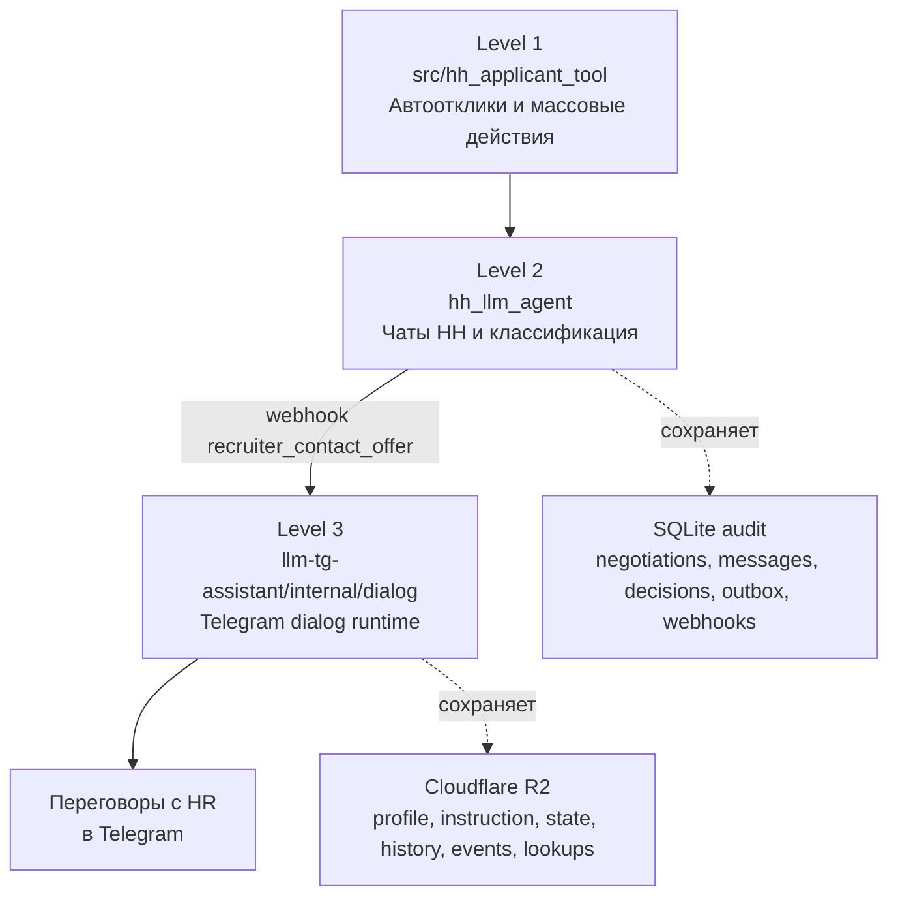

# Three-Level Job Search Architecture

Этот документ описывает трехуровневую архитектуру поиска работы между двумя репозиториями:

- `hh-applicant-tool` - уровни 1 и 2
- `llm-tg-assistant` - уровень 3

Главная идея такая:

1. Первый уровень массово создает входящий поток возможностей.
2. Второй уровень фильтрует отклики работодателей, извлекает полезный сигнал и поднимает контакт выше по воронке.
3. Третий уровень берет уже теплый контакт в Telegram и ведет живой диалог ближе к собеседованию.

## Общая картина

## Уровень 1. Автоотклики

Кодовая база: `src/hh_applicant_tool/`

Роль уровня:

- массово искать и обрабатывать вакансии;
- отправлять отклики, сопроводительные письма и выполнять связанные операции;
- поднимать резюме, работать с аккаунтом, хранить локальную базу данных;
- сеять максимальное количество "семян" для появления откликов от работодателей.

Практически это верх воронки. Здесь важен объем, покрытие и автоматизация рутины. Первый уровень не занимается глубокими переговорами, его задача - создать как можно больше релевантных точек входа.

## Уровень 2. Чаты HH и извлечение полезного сигнала

Кодовая база: `hh_llm_agent/`

Роль уровня:

- просматривать переговоры в чатах hh.ru после откликов первого уровня;
- отделять шум от полезных сигналов;
- отвечать там, где это имеет смысл, и не тратить токены на мусор;
- извлекать прямые контакты рекрутера и пересылать их на третий уровень.

Этот уровень не заменяет первый. Он проверяет урожай после массового посева:

- читает переговоры и историю сообщений;
- выделяет неотвеченный хвост сообщений работодателя;
- классифицирует пакет сообщений;
- для `human_actionable` и `bot_actionable` генерирует ответ прямо в hh-чате;
- для `recruiter_contact_offer` не отвечает в hh, а собирает context pack и отправляет webhook дальше.

Для сценария `recruiter_contact_offer` второй уровень выступает как bridge между HH и Telegram:

- извлекает `telegram_urls`, `telegram_handles`, `phones`, `emails` из текста сообщения;
- добавляет контекст по вакансии, работодателю, резюме и переговору;
- формирует `idempotency_key` вида `recruiter_contact_offer:<negotiation_id>:<last_message_id>`;
- отправляет payload на внешний webhook;
- сохраняет audit и статус доставки в локальную SQLite-базу.

Именно здесь появляется переход из экосистемы HH в более прямой и ценный канал - Telegram.

## Уровень 3. Telegram dialog runtime

Кодовая база: `/home/stfu/ai/llm-tg-assistant/internal/dialog`

Роль уровня:

- принимать уже теплый лид после второго уровня;
- резолвить, кому именно в Telegram нужно писать;
- инициировать личный диалог от имени userbot;
- продолжать переписку с учетом контекста вакансии, работодателя и предыдущего HH-сигнала;
- доводить разговор до более близких действий: уточнения, screening, назначение интервью, ответы на вопросы HR.

Это уже не уровень массового охвата, а уровень точечной коммуникации с заинтересованной стороной.

## Почему webhook нужно отправлять именно сюда

В `llm-tg-assistant` уже есть готовый ingress для HH:

- endpoint: `POST /webhooks/hh/recruiter-contact-offer`
- реализация HTTP-слоя: `internal/webhook/server.go`
- строгая модель payload: `internal/webhook/hh_models.go`
- маппинг во внутренний формат dialog: `HHRecruiterContactOfferRequest.ToInstructionRequest()`

Этот ingress уже умеет делать весь нужный переходный слой:

1. Проверяет `X-HH-Applicant-Event == recruiter_contact_offer`.
2. Проверяет, что `X-Idempotency-Key` совпадает с `body.idempotency_key`.
3. Проверяет `X-Webhook-Secret`.
4. Читает только один JSON object без лишних полей через strict decoder.
5. Валидирует минимально нужные поля payload.
6. Резолвит Telegram target.
7. Преобразует HH payload во внутреннюю `dialog.InstructionRequest`.
8. Сохраняет instruction и запускает Telegram dialog runtime.

То есть третий уровень уже является естественной точкой приема webhook от второго уровня.

## Как устроен `internal/dialog`

### 1. Strict domain model

Файл: `internal/dialog/models.go`

Внутренний контракт построен вокруг `InstructionRequest`:

- `instruction_id` - ключ идемпотентности;
- `telegram_user_id` - уже резолвленная цель в Telegram;
- `objective_key` - тип бизнес-цели;
- `contact` - метаданные по контакту;
- `context` - summary, notes и attributes от внешней системы;
- `initiator` - кто создал instruction;
- `created_at` - время создания сигнала.

Для HH ingress используется `objective_key = hh_recruiter_contact_offer`.

Это важный слой декуплинга: webhook-формат HH живет отдельно, а dialog runtime работает уже с единым внутренним форматом инструкций.

### 2. Ingestion service

Файл: `internal/dialog/service.go`

`dialog.Service` делает следующее:

- валидирует `InstructionRequest`;
- проверяет идемпотентность по `instruction_id`;
- сохраняет `ContactProfile`;
- сохраняет `DialogInstruction` вместе с prompt set;
- инициализирует `DialogState` со статусом `pending`;
- создает пустую `DialogHistory`;
- пишет audit event `instruction_received`.

После этого инструкция считается принятой, а runtime может начать диалог.

### 3. Runtime orchestration

Файл: `internal/dialog/runtime.go`

`dialog.Runtime` - это основной двигатель живого диалога. Он умеет:

- запускать диалог по новой инструкции;
- ставить opening message в outbox, а не слать сразу;
- принимать входящие private сообщения Telegram;
- нормализовать text, voice и photo через `internal/media`;
- собирать неотвеченный хвост пользовательских сообщений;
- классифицировать, нужен ли ответ;
- ставить ответы в outbox с задержками;
- не отправлять устаревший ответ, если пользователь уже дописал еще сообщения.

По сути это Telegram-аналог более "человечного" чат-цикла: collect -> classify -> queue -> dispatch.

### 4. LLM agent внутри dialog

Файл: `internal/dialog/agent.go`

`dialog.Agent` использует OpenRouter и выполняет три отдельные задачи:

- `GenerateOpening()` - пишет первое исходящее сообщение по instruction context;
- `ClassifyReply()` - решает, отвечать ли на неотвеченный хвост и в каком режиме (`single` или `qa_series`);
- `GenerateReplyMessages()` - генерирует 1-3 Telegram-сообщения.

Отдельно есть `InterpretIncoming()`, который превращает голосовое или фото в устойчивую текстовую заметку для истории диалога.

Это важно, потому что третий уровень работает не только с plain text, но и с реальными Telegram-форматами общения.

### 5. Policy layer

Файл: `internal/dialog/policy.go`

`dialog.Policy` отделяет бизнес-логику ответа от таймингов. Политика решает:

- ждать ли перед стартовым сообщением;
- сколько собирать входящий burst;
- когда именно отправлять reply;
- разрешен ли `qa_series`;
- как применять quiet hours и wake jitter.

Есть два режима:

- `ImmediatePolicy` - без задержек;
- `HumanizedPolicy` - с debounce, jitter, quiet hours и сериями сообщений.

То есть третий уровень уже проектирован как живой чат, а не как мгновенный webhook-бот.

### 6. Resolver: как webhook находит нужного человека в Telegram

Файл: `internal/dialog/target_resolver.go`

Резолв выполняется в строгом порядке:

1. `telegram handle / url`
2. локальные HH bindings (`negotiation_id`, `chat_id`, `resume_id`)
3. `phone`

Порядок принципиален:

- сначала используется самый точный публичный Telegram-сигнал;
- потом - уже накопленные локальные alias-индексы;
- телефон идет последним fallback.

После первого успешного резолва система сохраняет secondary bindings, чтобы последующие webhook-ы находили того же человека уже по локальному кешу, даже если новый payload беднее по контактам.

### 7. Persistence в R2

Состояние третьего уровня хранится не в SQLite, а в Cloudflare R2. Ключевые объекты:

- `contacts/<tg_user_id>/profile.json`
- `contacts/<tg_user_id>/instructions/<instruction_id>.json`
- `contacts/<tg_user_id>/dialogs/current/state.json`
- `contacts/<tg_user_id>/dialogs/current/history.json`
- `contacts/<tg_user_id>/dialogs/current/events/...`
- `lookups/telegram_username/<username>.json`
- `lookups/phone_e164/<phone>.json`
- `lookups/hh_negotiation_id/<negotiation_id>.json`
- `lookups/hh_chat_id/<chat_id>.json`
- `lookups/hh_resume_id/<resume_id>.json`

Это делает третий уровень durable:

- сохраняется текущее состояние диалога;
- сохраняется история переписки;
- сохраняется append-only audit trail;
- сохраняются alias-индексы для будущих HH webhook-ов.

## Сквозной путь сигнала: от HH к Telegram

### Шаг 1. Первый уровень создает входящий поток

`src/hh_applicant_tool/` массово отправляет отклики и запускает цепочку будущих переговоров.

### Шаг 2. Второй уровень наблюдает за переговорами в HH

`hh_llm_agent` читает переговоры и выделяет те случаи, где рекрутер уже оставил прямые контакты.

### Шаг 3. Второй уровень собирает context pack

В payload попадают:

- classifier metadata;
- candidate;
- negotiation;
- vacancy;
- employer;
- contacts from message;
- дополнительный контекст из вакансии и сайта работодателя;
- `employer_tail`.

### Шаг 4. Второй уровень отправляет webhook на третий

Назначение:

- endpoint: `POST /webhooks/hh/recruiter-contact-offer`
- событие: `recruiter_contact_offer`
- idempotency key: `recruiter_contact_offer:<negotiation_id>:<last_message_id>`

### Шаг 5. Третий уровень резолвит Telegram target

`llm-tg-assistant` пытается определить, с кем именно в Telegram нужно продолжить диалог.

### Шаг 6. HH payload превращается во внутреннюю instruction

HH ingress преобразует webhook в `dialog.InstructionRequest`, где:

- `objective_key = hh_recruiter_contact_offer`;
- `context.summary` собирается из рекрутера, вакансии, работодателя, кандидата и сигналов контакта;
- `context.notes` хранит короткие полезные факты;
- `context.attributes` хранит машинно-удобные поля для prompt и runtime.

### Шаг 7. Runtime начинает Telegram-переписку

После ingestion runtime ставит opening message в outbox и начинает активный dialog mode в личке.

### Шаг 8. Дальше работает уже живой Telegram-цикл

Третий уровень:

- принимает входящие сообщения HR;
- обновляет историю;
- собирает неотвеченный хвост;
- принимает решение reply/skip;
- отправляет ответ с humanized timing;
- не шлет устаревшие pending-сообщения.

## Границы ответственности по уровням

### Уровень 1 отвечает за масштаб

- поиск и массовый охват вакансий;
- создание максимального количества переговоров;
- первичную механизацию работы соискателя.

### Уровень 2 отвечает за отбор и эскалацию

- анализирует входящие реакции работодателей;
- отделяет шум от значимых сигналов;
- отвечает внутри HH там, где это уместно;
- выводит контакт наружу, если появился прямой Telegram/phone/email сигнал.

### Уровень 3 отвечает за close-range коммуникацию

- работает уже с конкретным человеком в Telegram;
- хранит долгоживущий контекст разговора;
- продолжает общение в более естественном канале;
- двигает коммуникацию к следующему шагу: уточнение, screening, договоренность о созвоне или собеседовании.

## Почему эта архитектура полезна

- Она разделяет массовую автоматизацию и точечные переговоры.
- Она не перегружает HH-агент задачами полноценного Telegram runtime.
- Она позволяет накапливать durable alias-индексы между HH и Telegram.
- Она делает webhook не финальной точкой, а мостом в долгоживущий active dialog.
- Она сохраняет audit на обоих концах: SQLite на уровне 2 и R2 на уровне 3.

## Итог

Текущая целевая схема выглядит так:

- `src/hh_applicant_tool/` - создает поток возможностей;
- `hh_llm_agent/` - проверяет отклики, извлекает полезные сигналы и шлет webhook;
- `/home/stfu/ai/llm-tg-assistant/internal/dialog` - принимает уже теплый сигнал и ведет переговоры с HR в Telegram.

Именно поэтому `llm-tg-assistant` и его `internal/dialog` нужно рассматривать как третий, более близкий к сделке слой общей архитектуры поиска работы.
